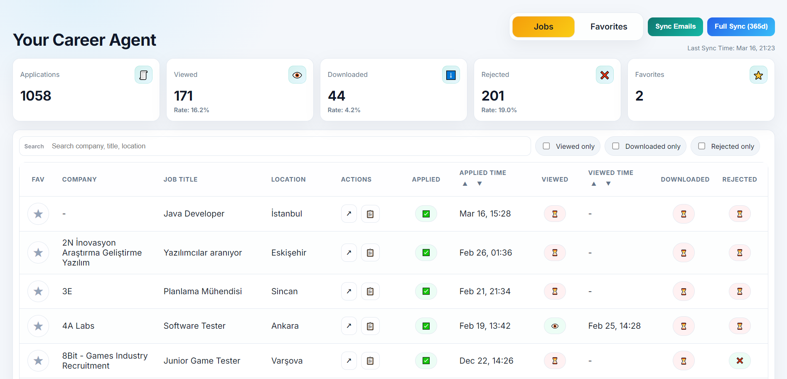
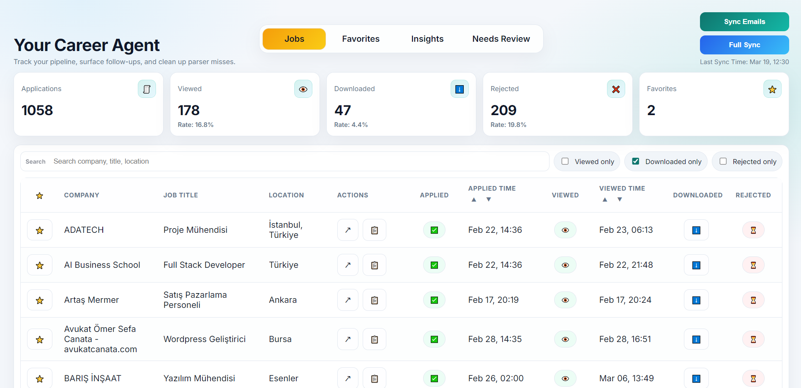
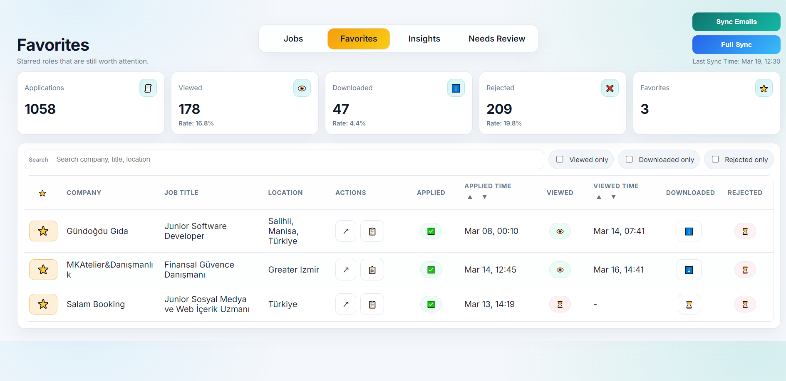
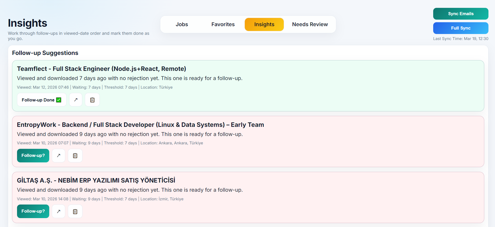
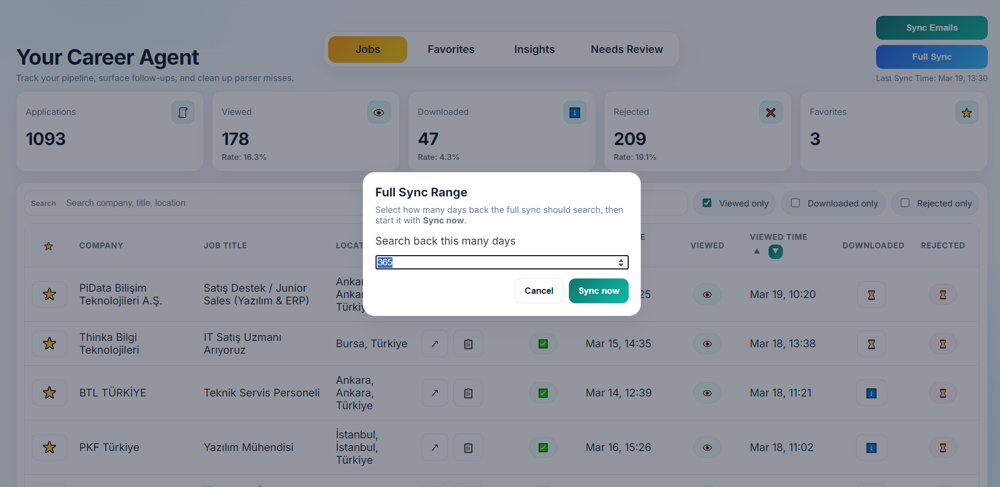
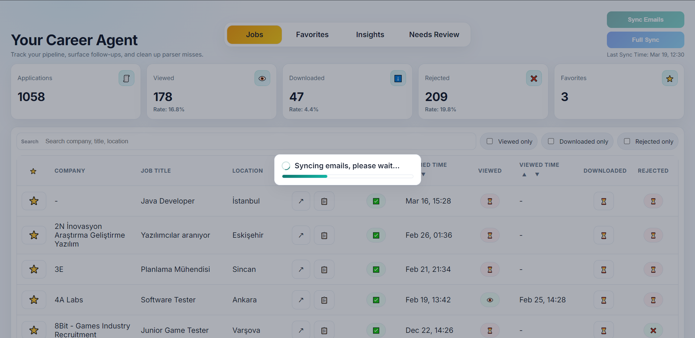

# Job Tracker

LinkedIn basvuru maillerini Gmail uzerinden okuyup yerel bir CSV veri tabanina yazan, sonra da bunlari kullanisli bir Flask arayuzunde takip etmeni saglayan kucuk ama pratik bir is takip sistemi.

Bu proje su problemlere odaklanir:

- Basvurdugun rolleri tek yerde toplamak
- Gorulen, indirilen, reddedilen ve favori ilanlari takip etmek
- Takip edilmesi gereken rolleri one cikarmak
- Parser'in ayiklayamadigi mailleri manuel duzeltip sistemi zamanla gelistirmek

## Neler Yapabiliyor?

- Gmail API ile LinkedIn bildirim maillerini okur
- Mail iceriginden `company`, `job_title`, `location`, `job_url` ve event durumlarini ayiklar
- Verileri `jobs.csv` icinde merge ederek duplicate kayitlari azaltir
- Incremental sync ve full sync akisini destekler
- Dashboard uzerinden filtreleme, arama ve siralama sunar
- `downloaded`, `favorite` ve `follow_up_done` gibi durumlari arayuzden degistirebilir
- Favori ilanlar icin ayri bir sayfa sunar
- Gec kalan gorulmus ilanlar icin follow-up odakli bir `Insights` sayfasi sunar
- Ayiklanamayan mailleri `Needs Review` alanina atar
- Manuel duzeltmeleri kaydederek sonraki sync'lerde yeniden kullanir

## Ekran Goruntuleri

### Genel Gorunum



### Jobs Dashboard



### Favorites Sayfasi



### Insights Sayfasi



### Full Sync Penceresi



### Sync Sirasinda



## Proje Yapisi

```text
job-tracker/
|- dashboard.py
|- sync_service.py
|- gmail_client.py
|- linkedin_parser.py
|- repository.py
|- review_repository.py
|- set_downloaded.py
|- jobs.csv
|- templates/
|  |- base.html
|  |- dashboard.html
|  |- insights.html
|  |- needs_review.html
|  `- review_detail.html
|- image.png
|- jobs.png
|- favorites.png
|- insights.png
|- full_sync.png
`- syncing.png
```

## Temel Dosyalar

- `dashboard.py`: Flask arayuzu, filtreleme, toggle endpoint'leri ve sayfa yonlendirmeleri
- `sync_service.py`: Gmail -> parser -> CSV senkronizasyon akisi
- `gmail_client.py`: Gmail API baglantisi ve mail cekme yardimcilari
- `linkedin_parser.py`: LinkedIn mail parse, normalize etme ve alan cikarma mantigi
- `repository.py`: CSV okuma, yazma, merge, toggle ve kayit guncelleme islemleri
- `review_repository.py`: `Needs Review` ve manuel correction verilerinin yonetimi
- `set_downloaded.py`: Terminalden kayit bulup `downloaded=True` yapmak icin yardimci CLI

## Gereksinimler

- Python 3.10+
- Google Cloud uzerinde olusturulmus Gmail API credentials
- `credentials.json`
- Ilk giristen sonra olusan `token.json`

Onerilen kurulum:

```bash
pip install flask google-api-python-client google-auth-httplib2 google-auth-oauthlib
```

## Kurulum

### 1. Repoyu hazirla

```bash
git clone <repo-url>
cd job-tracker
```

### 2. Bagimliliklari kur

```bash
pip install flask google-api-python-client google-auth-httplib2 google-auth-oauthlib
```

### 3. Gmail API ayarlarini ekle

Google Cloud tarafinda Gmail API erisimi acildiktan sonra `credentials.json` dosyasini proje kokune koy.

Ilk calistirmada OAuth akisi tamamlaninca `token.json` olusur.

## Calistirma

### Mail senkronizasyonu

```bash
python sync_service.py
```

Bu komut:

- Gmail'den LinkedIn maillerini bulur
- Mail icerigini parse eder
- `jobs.csv` dosyasini gunceller
- Gerekirse `Needs Review` kuyruğunu besler
- Son sync bilgisini `.sync_state.json` icinde saklar

### Dashboard'u acma

```bash
python dashboard.py
```

Ardindan tarayicida su adrese git:

```text
http://127.0.0.1:5000
```

### Opsiyonel: Terminalden downloaded isaretleme

```bash
python set_downloaded.py
```

## Uygulama Akisi

### 1. Jobs

Ana sayfa tum kayitlari listeler. Burada:

- Canli arama yapabilirsin
- `viewed`, `downloaded` ve `rejected` filtreleri uygulayabilirsin
- Basvuru ve gorulme zamanina gore siralayabilirsin
- Kaydi favoriye alabilirsin
- `downloaded` durumunu tek tikla guncelleyebilirsin

### 2. Favorites

Yildizlanan ilanlar ayri bir sayfada listelenir. Bu sayfa, tekrar donmek istedigin veya takip etmek istedigin rolleri hizlica ayirmak icin kullanislidir.

### 3. Insights

Gorulmus ama henuz reddedilmemis ve belli bir sure gecmis ilanlari one cikarir:

- `downloaded=True` ise daha kisa follow-up esigi kullanir
- Diger kayitlar icin daha genis bekleme suresi uygular
- Takip ettigin ilanlari `follow_up_done` olarak isaretlemene izin verir

### 4. Needs Review

Parser bir mailden yeterli bilgi cikarmazsa kaydi dogrudan kaybetmez. Bunun yerine:

- `Needs Review` listesine ekler
- Manuel duzeltme ekrani sunar
- Kaydettigin duzeltmeleri tekrar kullanmak uzere saklar

Bu sayede sistem zamanla daha dayanikli hale gelir.

## Veri Dosyalari

- `jobs.csv`: Tum basvurularin ana veri kaynagi
- `.sync_state.json`: Son sync zamani ve son kullanilan query bilgisi
- `needs_review.json` benzeri review verileri: parser'in cozemedigi mailler
- Manuel correction verileri: gelecekte ayni tip mailleri otomatik duzeltmek icin saklanir

## Sık Kullanilan Komutlar

```bash
python sync_service.py
python dashboard.py
python set_downloaded.py
```

## Guvenlik Notlari

Repoya sunlari eklememen iyi olur:

- `credentials.json`
- `token.json`
- Kisisel veri iceren gercek `jobs.csv` kopyalari
- OAuth veya API anahtari iceren ek config dosyalari

`.gitignore` dosyasini bu dosyalari kapsayacak sekilde guncel tut.

## Gelistirme Fikirleri

- Export/import destegi
- Daha gelismis dashboard istatistikleri
- Otomatik testler
- Docker kurulumu
- `requirements.txt` veya `pyproject.toml` eklenmesi
- Gmail disindaki kaynaklar icin adaptor yapisi

## Lisans

Bu repo su an acik bir lisans dosyasi icermiyor. Istersen `MIT` lisansi ekleyerek dagitim ve tekrar kullanimi daha net hale getirebilirsin.
